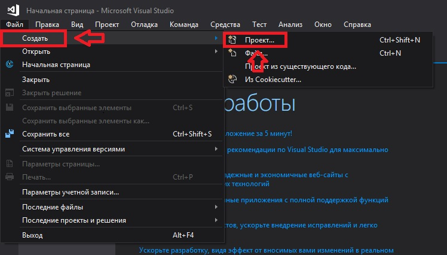
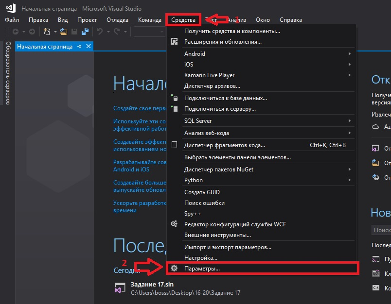
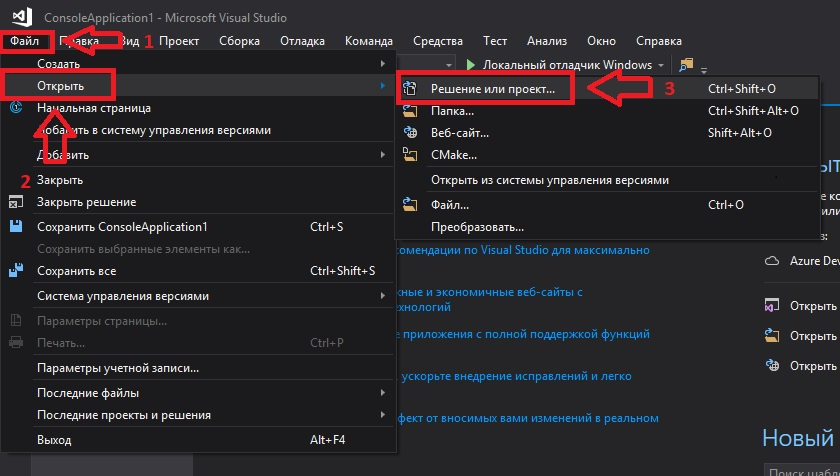
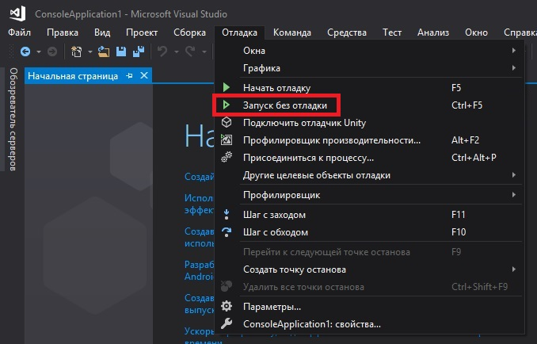
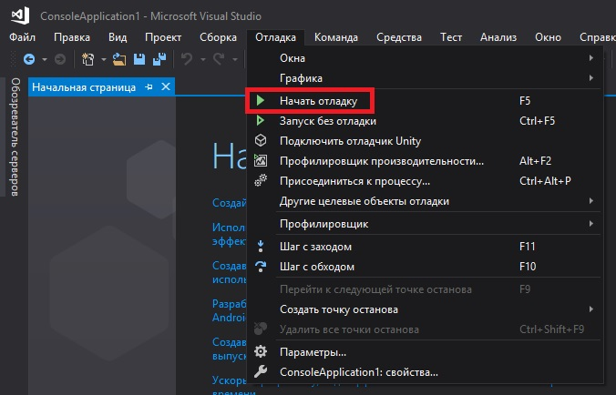
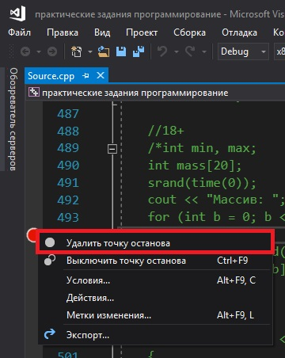

МИНИСТЕРСТВО НАУКИ  И ВЫСШЕГО ОБРАЗОВАНИЯ РОССИЙСКОЙ ФЕДЕРАЦИИ  
Федеральное государственное автономное образовательное учреждение высшего образования  
"КРЫМСКИЙ ФЕДЕРАЛЬНЫЙ УНИВЕРСИТЕТ им. В. И. ВЕРНАДСКОГО"  
ФИЗИКО-ТЕХНИЧЕСКИЙ ИНСТИТУТ  
Кафедра компьютерной инженерии и моделирования
  
​
### Отчёт по лабораторной работе № 01   по дисциплине "Программирование"
 
​студента 1 курса группы ПИ-б-о-192(2)
Круглекова Дмитрия Вячеславовича
направления подготовки 09.03.04 "ПРОГРАММНАЯ ИНЖЕНЕРИЯ"  
 
​
<table>
<tr><td>Научный руководитель  старший преподаватель кафедры  компьютерной инженерии и моделирования</td>
<td>(оценка)</td>
<td>Чабанов В.В.</td>
</tr>
</table>
  
​
Симферополь, 2019  

#### Цель: Изучить основные возможности создания и отладки программ в IDE MS Visual Studio.  
#### Ход работы  

**1.Как создать консольное приложение С++**  
Для начала следует установить и открыть *MS Visual Studio*  
  (рис. 1 Ярлык приложения MS Visual Studio).   
Далее в верхнем левом углу нажать на: *Файл-> Создать-> Проект*   (*Рис.2 Меню файл*).   (*Рис.3 Меню файл-> Создать-> Проект*).   
После этого на экране появиться окно с выбором проекта. Мы вибираем *"Консольное приложение Windows  Visual C++"* и нажимаем *"Ок"*   (*Рис.4 Создание консольного приложения*).<  
После нажатия на кнопку у нас начинается создание проекта и повляеться окно,где мы можем писать код 

**2.Как изменить цветовую схему (оформление) среды**  
Для изменения цветовой схемы требуется нажать на: *Средства-> Параметры*  (*Рис.5 Меню средства-> Параметры*).  
В появившемся окне справа найти *"Общие"*, найти *"Цветовая схема"* и нажать на список справа от нее. 
В списке выбрать интересующую вас тему и нажать *"ОК"*    (*Рис.6 Выбор темы*). 

**3.Как закомментировать/раскомментировать блок кода средствами VS** 
1. Для того,чтобы закоментировать код,нужно: Выделить часть кода,которую вы хотите закоментировать   (*Рис.7 Выделение интересующего нас кода*)   и нажать комбинацию *Ctrl+K,Ctrl+C*   (*Рис.8 То что получилось после комбинации Ctrl+k, Ctrl+C*).  
2. Для того,чтобы раскоментировать код,нужно: Выделить часть кода,которую вы хотите раскоментировать   (*Рис.9 Выделение интересуещего кода*)   и нажать комбинацию *Ctrl+K,Ctrl+U*   (*Рис.10 То, что получилось после комбинации Ctrl+K,Ctrl+U*). 

**4.Как открыть в проводнике Windows папку с проектом средствами VS**  
Чтобы открыть проект,нужно нажать на:*Файл-> Открыть-> Решение или проект*  (*Рис.11 Меню Файл-> Открыть-> Решение или проект*).  
Далее вы попадёте в проводник со всеми соханенными проектами в папке repos  (Рис.12 Папка Repos).  
Выбираем папку с проектом и переходим в такую же папку  (*Рис.13 Папка проекта*).  
В ней ищем файл с расширением *".vcxpoj"*,нажимаем на него после чего нажимаем *"ОК"*  (*Рис.14 Открываем файл проекта*). 

**5.Какое расширение файла-проекта используется в VS**  
Файл-проекта использует *".vcxpoj"*  (*Рис.15 Расширение файла проекта*). 

**6.Как запустить код без отладки (не менее 2 способов)**  
Для того,чтобы запустить код без отладки нужно нажать на: Отладка-> Запуск без отладки; или просто нажать *Ctrl+F5*;  (*Рис.16 Меню Отладка-> Запустить без отладки*). 
 После чего запустится консоль

**7.Как запустить код в режиме отладки (не менее 2 способов)**  
Для того,чтобы запустить код в режиме отладки нужно нажать на: Отладка-> Начать отладку; или просто нажать F5  (*Рис.17 Меню Отладка-> Начать отладку*). 
 После чего запустится консоль

**8.Как установить/убрать точку останова (breakpoint)**  
Для того,чтобы установить breakpoint,нужно нажать на полосу справа от кода  (*Рис.18 Полоса для точек становки*)   в месте,где вы хотите поставить точку  (*Рис.19 Точка остановки появилась*).  
Для того,чтобы убрать breakpoint,нужно нажать пкм по точке,после чего нажать на "Удалить точку останова".  (*Рис.20 Удаление точки остановки*). 

**9.Создайте программу со следующим кодом:** 
~~~c++
#include <iostream>
int main() {
    int i;
    i = 5;
    std::cout << i;
    return 0;
}
~~~

Для начала, я создал консольное приложение и скопировал код в него  (*Рис.21 Код*)  (программа попросила библиотеку "pch.h", так что я добавил и ее.). 
Далее я поставил точки остановки там, где это требовалось в задании  (*Рис.22 Точки остановки*).  
После этого я нажал F5 и начал отладку. 
Программа преобразовала вид  (*Рис.23 Преобразование вида программы*).  
Значение i в первом breakpoint  (*Рис.24 Значение i в первом BreakPoint*).  
Значение i во втором breakpoint  (*Рис.25 Значение i во втором BreakPoint*).  

**10.Выполните задание 9 изменив программу на следующую:** 
~~~C++
#include <iostream>
int main() {
    double i;
    i = 5;
    std::cout << i;
    return 0;
}
~~~
Заменив *int* на *double* я запустил программу. 
Значение i в первом breakpoint  (*Рис.26 Значение i в первом BreakPoint*).  
Значение i во втором breakpoint  (*Рис.27 Значение i во втором BreakPoint*).  
**Вывод:** Я изучил основные возможности создания и отладки программ в IDE MS Visual Studio.