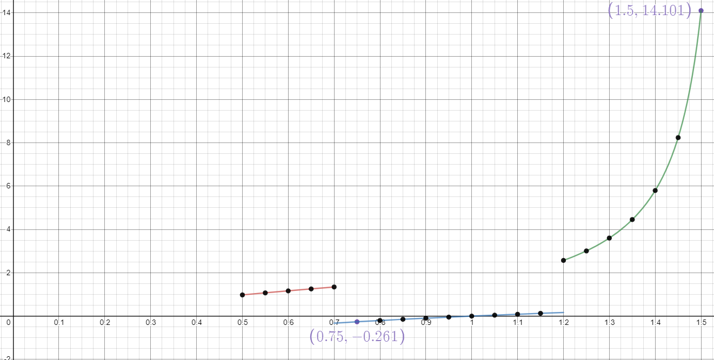

МИНИСТЕРСТВО НАУКИ  И ВЫСШЕГО ОБРАЗОВАНИЯ РОССИЙСКОЙ ФЕДЕРАЦИИ  
Федеральное государственное автономное образовательное учреждение высшего образования  
"КРЫМСКИЙ ФЕДЕРАЛЬНЫЙ УНИВЕРСИТЕТ им. В. И. ВЕРНАДСКОГО"  
ФИЗИКО-ТЕХНИЧЕСКИЙ ИНСТИТУТ  
Кафедра компьютерной инженерии и моделирования
<br/><br/>

### Отчёт по лабораторной работе №2<br/> по дисциплине "Программирование"
<br/>

студента 1 курса группы ПИ-б-о-191(2)  
Круглекова Дмитрия Вячеславовича
направления подготовки 09.03.04 "Программная инженерия"  
<br/>

<table>
<tr><td>Научный руководитель<br/> старший преподаватель кафедры<br/> компьютерной инженерии и моделирования</td>
<td>(оценка)</td>
<td>Чабанов В.В.</td>
</tr>
</table>
<br/><br/>

Симферополь, 2020

## Лабораторная работа №2
Табулирование кусочно-заданной функции\
\
**Цель:** 
1. Овладеть практическими навыками разработки и программирования вычислительного процесса циклической структуры.
2. Сформировать навыков программирования алгоритмов разветвляющейся структуры.
3. Изучить операторы ветвления. Особенности использования полной и сокращенной формы оператора **if** и тернарного оператора.
\
**Ход работы:**\
**1\.** Напишите на языке С++ программу которая для функции **f(x)** на интервале **x ∈ [Xнач; Xкон]**:
* выводит в консоль значения функции **f(x)** с шагом **dx**;
* определяет максимальное и минимальное значение функции.\
Вариант 7


```C++
#include <iostream>
#include <cmath>

using namespace std;

int main() 
{
  setlocale(LC_ALL, "RUS");

  double a, b, x1, x2, d, temp, x_max = -INFINITY, x_min = INFINITY, x;
  bool flag = true;
  cout << "Начало и конец отсчета." << endl;
  cin >> x1 >> x2;
  x = x1;
  cout << "Шаг:";
  cin >> d;
  cout << "Начало и конец нужного интервала." << endl;
  cin >> a >> b;
  cout << 'x' << " | " << 'y' << endl;

  for (int i = 0; i <= (x2 - x1) / d; i++, x += d) {

    if (x <= a)
      temp = abs(x) + sin(x);
    else
      if ((a < x) && (x < b)) 
        temp = (log(abs(x))) / log(3);
      else 
        if (x >= b)
          temp = tan(x);

    if ((x >= a) && (x <= b + d))
    {
      if (temp < x_min)
      {
        x_min = temp;
      }
      if (temp > x_max)
      {
        x_max = temp;
      }
    }
    cout << x << " | " << temp  << endl;
  }
  cout << endl;
  cout << "max: " << x_max << "  min: " << x_min << endl;
  system("pause");
  return 0;
}

```
\
**2\.** Протабулируйте функцию и запишите получившиеся реультаты в отчёт в виде таблицы.
При этом **a** = 0.7, **b** = 1.2, начала и конца интервала **Xнач** = 0.5, **Xкон** = 1.5 и шага **dx** = 0.05.\
**3\.** Определите минимальное и максимальное значение функции на указанном интервале.\
**min**=-0.32466  **max**=2.57215\
**4\.** Постройте график функции. Добавьте на график точки, которые у вас получились в процессе табуляции.
Добавьте на график точки минимума и максимума с метками значений.

\
*рис.1: График функции*\
\
\
*рис.2: Таблица точек*\
\
**Вывод:** На этой лабораторной работе я изучил структуру циклического вычисления.


