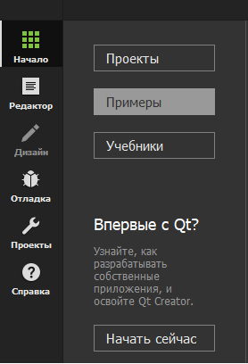
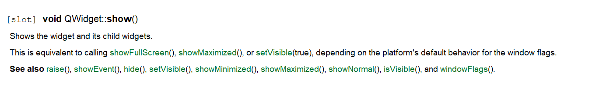

МИНИСТЕРСТВО НАУКИ  И ВЫСШЕГО ОБРАЗОВАНИЯ РОССИЙСКОЙ ФЕДЕРАЦИИ  
Федеральное государственное автономное образовательное учреждение высшего образования  
"КРЫМСКИЙ ФЕДЕРАЛЬНЫЙ УНИВЕРСИТЕТ им. В. И. ВЕРНАДСКОГО"  
ФИЗИКО-ТЕХНИЧЕСКИЙ ИНСТИТУТ  
Кафедра компьютерной инженерии и моделирования
<br/><br/>
​
### Отчёт по лабораторной работе № 7 <br/> по дисциплине "Программирование"
<br/>​
студента 1 курса группы ПИ-б-о-192(2)
<br/>
Круглекова Дмитрия Вячеславовича
<br/>
направления подготовки 09.03.04 "ПРОГРАММНАЯ ИНЖЕНЕРИЯ"  
<br/>​
<table>
<tr><td>Научный руководитель<br/> старший преподаватель кафедры<br/> компьютерной инженерии и моделирования</td>
<td>(оценка)</td>
<td>Чабанов В.В.</td>
</tr>
</table>
<br/><br/>
​
Симферополь, 2020<br/><br/>

### **Цель: изучить основные возможности создания и отладки программ в IDE Qt Creator.** <br/>
#### **Ход работы** <br/>

**1. Как создать консольное приложение С++ в IDE Qt Creator без использования компонентов Qt?** <br/>
Чтобы создать такое приложение, требуется перейти в **Файл** => **Создать файл или проект**.

<br/>Рис.1 Создать файл или проект...<br/>

Выбрать проект без QT, после чего приложение на С++, далее выбирать директорию и нажать далее. <br/>

<br/>Рис.2 Создание проекта С++.<br/>

**2. Как изменить цветовую схему (оформление) среды?** <br/>
Выбирать **Инструменты** => **Параметры** => **Среда**.

<br/>Рис.3 Инструменты => Параметры.<br/>

Выбрать нужную тему, затем перезагрузить QT Creator.<br/>

<br/>Рис.4 Выбор цвета интерфейса.<br/>

**3.Как закомментировать/раскомментировать блок кода средствами Qt Creator?** <br/>
Выделить нужную часть кода и нажать **Ctrl+/**.<br/>

**4.Как открыть в проводнике Windows папку с проектом средствами Qt Creator?** <br/>
Нажать на **Файл** => **Открыть файл или проект**, затем перейти в директорию программы и запустить файл.pro.<br/>

<br/>Рис.5 Открытие файла, или проекта.<br/>

**5.Какое расширение файла-проекта используется Qt Creator?**<br/>
.pro <br/>

**6.Как запустить код без отладки?**<br/>
Нажать на зелёный треугольник слева-внизу.

<br/>Рис.6 Зеленый треугольник слева-снизу.<br/>

Либо **Ctrl+R**. <br/>

**7.Как запустить код в режиме отладки?**<br/>
Нажать на зелёный треугольник слева внизу с изображением жука.

<br/>Рис.7 Зеленый треугольник с жуком слева-снизу.<br/>

Либо **F5**.<br/>

**8.Как установить/убрать точку останова (breakpoint)?**<br/>
Левая кнопка мыши по полосе рядом с обозначением номера строки кода.<br/>

<br/>Рис.8 Точка останова.<br/>

**9.Создайте программу со следующим кодом:**<br/>
```c++
#include <iostream>
int main() {
    int i;
    double d;
    i = 5;
    d = 5;
    std::cout << i << d;
    return 0;
}
```
В пятой строке i=0;<br/>
В шестой строке d=2.0500689e-316;<br/>
В седьмой строке i=d=5;<br/>
Значения не совпадают с MSVS.<br/>

**10.Закройте проект и перейдите на вкладку «Начало» => «Примеры»;**<br/>

<br/>Рис.9 Примеры.<br/>

**11.Выберите проект «Calculator Form Example». Для этого можно воспользоваться строкой поиска;**<br/>

<br/>Рис.10 Calculator Form Example.<br/>

**12.Изучите (по желанию) описание проекта в открывшемся окне;**<br/>

**13.Сейчас вы находитесь на вкладке «Проекты». Выберите комплект сборки. На рис. 1 присутствует только один комплект, но их может быть больше, например для сборки под Android или компилятором MSVS;**<br/>

**14.Перейдите на вкладку «Редактор» и запустите сборку проекта;**<br/>

**15.В инспекторе проекта выберите файл «main.cpp». В этом файле установите курсор на слово «show» в строке calculator.show(); и нажмите F1. Изучите справочную информацию. Таким же образом можно получить справку по любому объекту/методу/полю доступному в Qt;**<br/>

<br/>Рис.11 main.cpp.<br/>

<br/>Рис.12 Справочная информация.<br/>

**16.В инспекторе проекта выберите файл «Формы» => «calculatorform.ui» и дважды счёлкните ЛКМ;**<br/>
<br/>Рис.13 То, что открылость после двойного нажатия на «calculatorform.ui»<br/>

**17.Вы попали на вкладку «Дизайн». На форме замените английский текст на русский. Пересоберите проект.**<br/>
<br/>Рис.14 Изменение ангийских слов на русские<br/>

<br/>Рис.15 Собранный результат<br/>

**Вывод:** Я изучил основные возможности создания и отладки программ в IDE Qt Creator.
